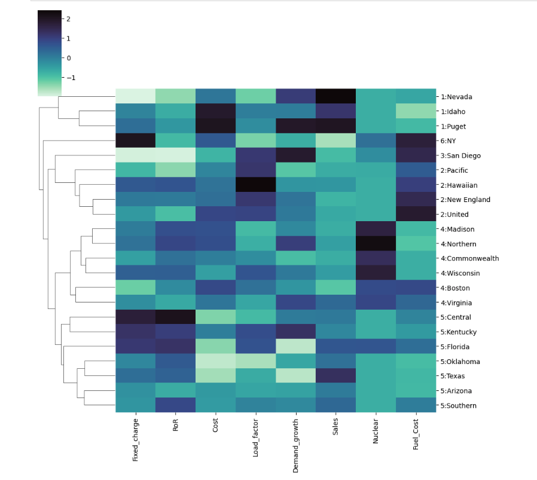
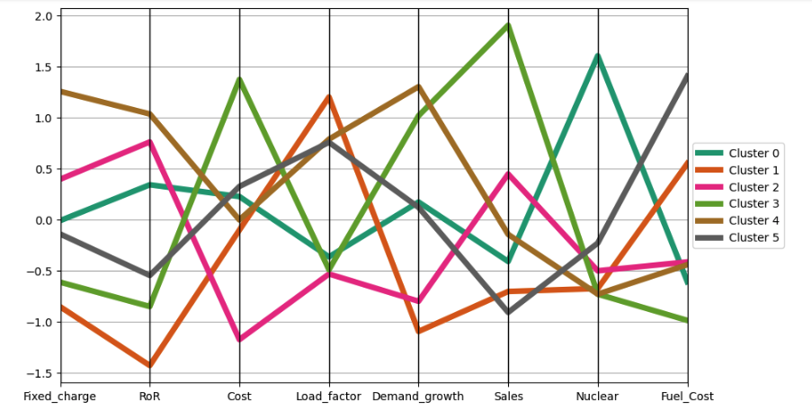

 # Cluster Analysis of Utility Companies

This project performs a comprehensive cluster analysis on a utilities dataset to group companies based on their financial and operational performance metrics.  

## Project Overview ##

In this analysis, I explored how different utility companies naturally segment into groups using two primary clustering techniques: Hierarchical Clustering and K-Means.  

## Key Steps & Methodology ##

* Data Preparation: Loaded the utilities dataset and performed essential data cleaning.  
* Normalization: Applied Z-score standardization to ensure variables with different scales, such as Sales and Fuel Cost, contributed equally to the model.  
* Distance Metrics: Calculated Euclidean distances to measure the similarity between different company profiles.  
* Hierarchical Clustering: Used Dendrograms and various linkage methods (Single and Complete) to visualize the branching relationships between companies.  
* K-Means Clustering: Employed the Elbow Method to determine the optimal number of clusters (k) and segmented the utilities into distinct groups.

 
 
## Visualizing the Clusters with a Heatmap
To see the relationships between different utility companies, I generated a clustered heatmap (clustermap) using Seaborn. This visualization allows us to see not just the groupings, but the specific metrics that drive those groupings.

**Dendrograms:** The tree-like structures on the left and top represent the hierarchy of similarities between companies and features.

**Color Scale:** Darker colors represent higher normalized values for metrics like Sales or Fuel_Cost, while lighter colors represent lower values.

**Company Groupings:** You can see how Cluster 1 (e.g., Nevada, Idaho) is grouped separately due to high Demand_growth, while Cluster 4 represents a more standard operational profile.

## Key Cluster Insights

**Cluster 1 (Nevada, Idaho, Puget):** Positioned at the top, these companies show a distinct profile with dark cells in the Demand_growth and Fuel_Cost columns.

**Nuclear Differentiation:** The Nuclear column acts as a strong separator. You can see concentrated dark blocks for specific groups, indicating a high reliance on nuclear power compared to the rest of the dataset.

**Cluster 4 & 5 (The Large Groups):** These comprise the majority of the companies (e.g., Boston, Wisconsin, Florida, Texas). They exhibit more uniform, lighter color patterns across most metrics, suggesting they share relatively standard industry profiles.

**Outliers:** San Diego (Cluster 3) and NY (Cluster 6) appear as distinct branches on the dendrogram, meaning their data signatures are unique enough to keep them separate from the larger utility groups.

 
 

## Business Insights & Findings ##

Through this analysis, I identified several key business insights based on how the utility companies grouped together:  
* Efficiency Leaders: One cluster stood out with high sales and low fuel costs, representing the most operationally efficient companies in the dataset.  
* High-Cost Clusters: Another group was characterized by high fixed charges and lower rates of return, suggesting these companies may need to re-evaluate their infrastructure investments or pricing models.  
* Market Outliers: The analysis revealed specific companies that did not fit neatly into large clusters, highlighting unique market players with unconventional operational profiles.  
By the end of the project, I successfully segmented the utilities into distinct groups. This provides a clear framework for understanding market patterns and making data-driven business recommendations for each specific cluster.  

## Segmentation Summary: Cluster Profiles

* Cluster 0 (5 members): Moderate operational metrics with stable within-cluster variance (10.66).
* **Cluster 1 (1 member):** A unique outlier with 0.00 within-cluster sum of squares, indicating a distinct profile."
* Cluster 2 (6  members): A primary group showing similar financial signatures (20.28 variance).
* Cluster 3 (3 members): A smaller niche group with tight operational alignment (9.99 variance).
* **Cluster 4 (1 member):** Another unique single-member cluster, likely representing a specific utility model."
* Cluster 5 (6 members): The most diverse primary group with higher internal variation (32.27).

## Business Value & Strategic Impact
The primary goal of this analysis is to demonstrate how unsupervised machine learning can translate complex operational metrics into a strategic roadmap. By identifying these distinct clusters, utility executives and stakeholders can:

Tailor Infrastructure Investment: Grouping companies by Demand_growth and Nuclear reliance allows for more accurate forecasting of future energy needs and infrastructure upgrades.

Benchmark Performance: Utilities in the "industry average" clusters (like Cluster 0 and 2) can use these results to identify peer organizations for operational benchmarking and cost-optimization strategies.

Risk Mitigation: Identifying outliers (like Cluster 1 and 4) helps in recognizing unique market risks or specialized business models that require custom regulatory or financial approaches.

Ultimately, this project shows that clustering is not just a mathematical exercise, but a powerful tool for data-driven decision-making in the energy sector.

## Conclusion ##
This project demonstrates how unsupervised learning can transform raw operational data into actionable business intelligence. By identifying these clusters, utility managers can tailor their strategies—such as optimizing fuel costs for one specific group or adjusting rate structures for another—rather than applying a one-size-fits-all approach. This analysis serves as a foundation for more advanced predictive modeling or targeted resource allocation in the utilities sector.  

## Technologies Used ##
### Python  
* Pandas for data manipulation  
* Scikit-Learn for K-Means and scaling  
* SciPy for hierarchical clustering and dendrogram visualization  
* Matplotlib & Seaborn for data visualization  

